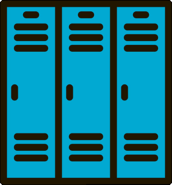

Locker
===

Locker is a container runtime example to show you that containers are just processes with isolation. We can provide this isolation simply, in a way that's easy to demonstrate.

This project is inspired by Liz Rice's talk, [Containers from Scratch](https://www.youtube.com/watch?v=Utf-A4rODH8).

See also:
- [Cgroups, Namespaces, & Beyond](https://www.youtube.com/watch?v=sK5i-N34im8) - Jeromme Petazonni
- [Building containers in Pure Bash and C](https://containersummit.io/events/nyc-2016/videos/building-containers-in-pure-bash-and-c) - Jessie Frazzelle


Let's start with the two fundmental components of a container, namespaces and cgroups.

# Namespaces #

A namespace is a scope of resource that something has access to. There are 6 common types of namespaces:

- Process ID - This namespace makes sure your process/container can't see your local process tree.
- User - User namespace keeps users created from within a container from access your host(s) users or creating new users on your host
- Filesystem - Filesystem namespacing gives containers their own specific space, and keeps the container from accessing subtrees of the root filesystem on the host.
- Network - This allows your container to run its own virtualized interface so your containers can't read host packets directly or otherwise interact directly with youor ethernet device on the host
- Unix Timesharing System - UTS Namespaces allow your containers to have their own hostnames and domains
- IPC - Interprocess Communication namespace keeps processes, or containers, from accessing each other's shared memory to prevent errors or malicious activity

To have a good container runtime, we'll need to implement these namespaces ourselves, though this example focuses on Process, User, Filesystem and UTS namespaces only for simplicity.

# Control Groups #

Controls groups are the other essential element of a container runtime. What do control groups do? Control groups limit access to host resources, such as:
- CPU
- RAM
- Disk I/O
- Network I/O
- Filesystem Cache

In addition to resource limiting, control groups can be used to prioritize access to resources such as CPU and Disk, it can be used for accounting if you need to measure a group's resources, and it can be used to control a groups' processes, to do things like checkpoint and restart processes.

This example uses no control groups as to remove complexity from this example.


# Caveats #

Currently, Mac OS doesn't support a lot of the features that are required for good namespace isolation, such as mounts and more. For that reason, this ships with a vagrant and a docker container.

To use the Vagrant run:
```sh
vagrant up locker
vagrant ssh locker
cd go/src/github.com/ryanhartje/locker/
make build
./bin/locker run /bin/bash
```

To use Docker run:
```sh
docker build -t locker .
docker run --rm -d --name locker locker sleep 3600
docker exec -ti locker /bin/bash
```

This will give you access to the workspace in an environment suited for testing/experimentation.


# Getting started #

As a first step, let's think about what it takes to run a container. Really, we need to know what command to run and where to run it in terms of what filesystem. At first, we can expect that when we run a command, its in our filesystem since we haven't made a filesystem construct yet. We'll have to run our processes uncontained. Let's start there.

What does a basic proc runner look like? Something like this should do it:
```golang
package main

import (
	"fmt"
	"os"
	"os/exec"
)

// go run main.go run <cmd> <args>
func main() {
	switch os.Args[1] {
	case "run":
		run()
	default:
		panic("help")
	}
}

func run() {
	fmt.Printf("Running %v \n", os.Args[2:])

	cmd := exec.Command(os.Args[2], os.Args[3:]...)
	cmd.Stdin = os.Stdin
	cmd.Stdout = os.Stdout
	cmd.Stderr = os.Stderr

    err := cmd.Run()
    if err != nil {
        panic(err)
    }
}
```
modified from [containers-from-scratch](https://github.com/lizrice/containers-from-scratch/blob/master/main.go)

What do we get if we run this as we would a container?

```sh
go run main.go run /bin/bash
Running [/bin/bash]
bash-3.2$ whoami
ryan
```

As we can see, if I just exec /bin/bash in a forked process, it initially provides no isolation. No big suprise but now we have something we can build on.

